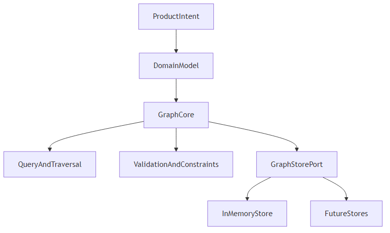
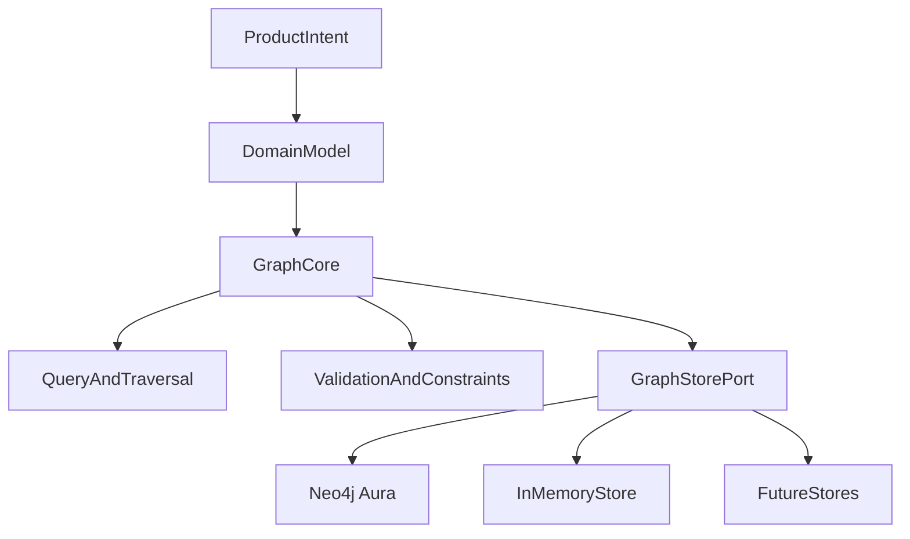

# Groovegraph Architecture

## 1. Purpose

Groovegraph is a property-graph core for recorded music intelligence. It models music entities as nodes, relationships as edges, and descriptive metadata as first-class properties on both.

The architecture prioritizes:

- Rich relationship discovery
- Strong domain expressiveness for recorded music
- Type-safe TypeScript contracts
- Storage portability via pluggable backends

## 2. Architectural Principles

1. **Property graph, not triples-only**  
   Nodes and edges both carry arbitrary typed properties.
2. **Domain-first modeling**  
   The graph structure should reflect how music is actually made, released, credited, and consumed.
3. **Storage-agnostic core**  
   Core logic depends on interfaces, not a concrete database.
4. **Deterministic graph operations**  
   CRUD, linking, and traversal semantics should be predictable and testable.
5. **Reference isolation**  
   Prior projects are informational only and do not constrain implementation details.

## 3. Conceptual Layers

Mermaid source

### Layer responsibilities

- **Domain Model**: Music-oriented entity/relationship taxonomy.
- **Graph Core**: Node/edge lifecycle and mutation orchestration.
- **Query & Traversal**: Neighborhood, filtered traversal, and pattern lookup.
- **Validation & Constraints**: ID, schema, and relationship-rule enforcement.
- **Store Port**: Interface boundary for persistence adapters.

## 4. Core Graph Primitives

### Node

- `id`: unique stable identifier
- `labels`: one or more semantic labels (for example `Track`, `Artist`, `Studio`)
- `properties`: typed key-value map
- `meta`: optional system fields (timestamps, provenance). For **Connection Curator**–driven enrichment, provenance fields (e.g. source URL, retrieved date, excerpt) are stored here or in dedicated properties so every enriched fact is traceable.

### Edge

- `id`: unique stable identifier
- `type`: relationship type (for example `PERFORMED_BY`, `RECORDED_AT`)
- `fromNodeId` / `toNodeId`: directed linkage
- `properties`: typed key-value map (roles, dates, confidence, etc.)
- `meta`: optional system fields

### Property Value Model

Supported scalar and structured values:

- `string`, `number`, `boolean`, `null`
- ISO date/datetime strings
- arrays of supported scalar values
- shallow object maps when explicitly allowed

## 5. Domain Shape for Recorded Music

The full ontology—node labels (entity types), properties per type, edge types (relationships), and advanced structures (SongWork vs Track, instrument hierarchy, effects, provenance)—is defined in **[DOMAIN_MODEL.md](DOMAIN_MODEL.md)**. That document is the single source of truth for the recorded-music graph and supersedes any entity/relationship definitions from prior projects.

Summary:

- **Node labels**: Artist, Album, Track, Equipment, **Instrument** (type, brand, model, year of manufacture, family, sub_family, etc.), Studio, Person, Credit, Label, Performance, Effect, Genre, Playlist, Venue, SongWork, Session, Release (see DOMAIN_MODEL for full property lists).
- **Edge types**: PERFORMED_BY, WRITTEN_BY, PRODUCED_BY, RELEASED_ON, RECORDED_AT, USED_EQUIPMENT, RELEASED_BY, FEATURES, MASTERED_BY, ENGINEERED_BY, MEMBER_OF, CONTAINS, COLLABORATED_WITH, INFLUENCED_BY, COVERS, REMIXES, and others (see DOMAIN_MODEL for semantics and typical from/to).

## 6. Query and Traversal Model

The query model is optimized for discovery rather than only direct key lookup.

### Query capabilities (v1)

- Node lookup by ID and label
- Property-filtered node search
- Edge-filtered neighborhood expansion
- K-hop traversal with stop conditions
- Path discovery between two node IDs with type constraints

### Traversal semantics

- Direction modes: outbound, inbound, both
- Edge-type allowlist/denylist
- Node-label filters at each hop
- Max depth and max result safeguards

## 7. Indexing Strategy (v1)

Indexes are logical contracts in the core API. Concrete stores can optimize differently.

Required index categories:

- Node ID index
- Edge ID index
- Label index (`label -> node IDs`)
- Property index (`label + property key + property value -> node IDs`)
- Adjacency index (`node ID -> incident edge IDs`)

## 8. Validation and Constraints

Validation is explicit and fail-fast:

- ID uniqueness for nodes/edges
- Edge endpoint existence checks
- Allowed relationship matrix (optional domain rules)
- Property type validation against label/type schemas
- Immutable system fields where applicable

## 9. Non-Goals for This Architecture

- No Graphiti coupling
- No memory-synchronization subsystem
- No agent runtime concerns
- No storage lock-in at architecture level

## 10. Implementation Readiness

This architecture is intended to translate directly into:

- TypeScript type contracts for primitives and commands
- A `GraphStore` interface with Neo4j Aura as the production backend and InMemory as reference
- A core service that composes validation + persistence + traversal
