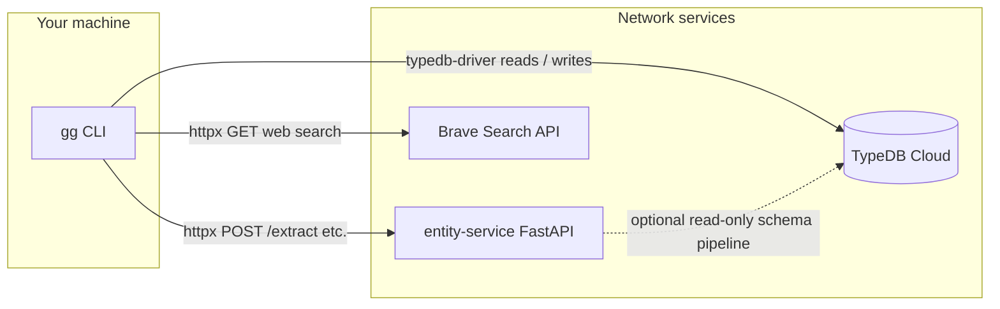
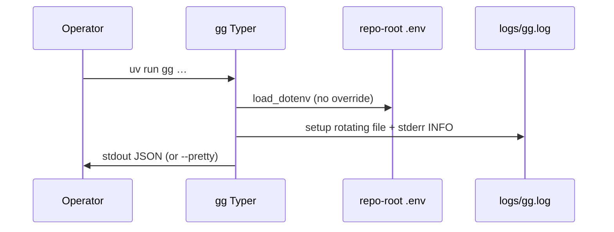
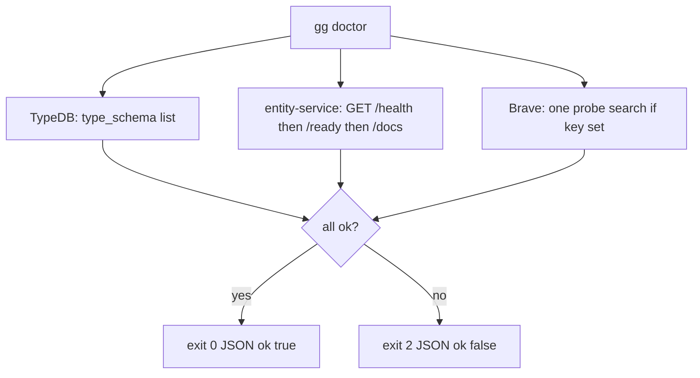
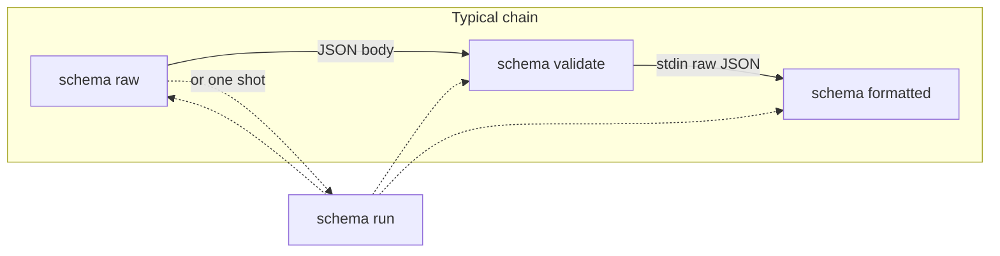
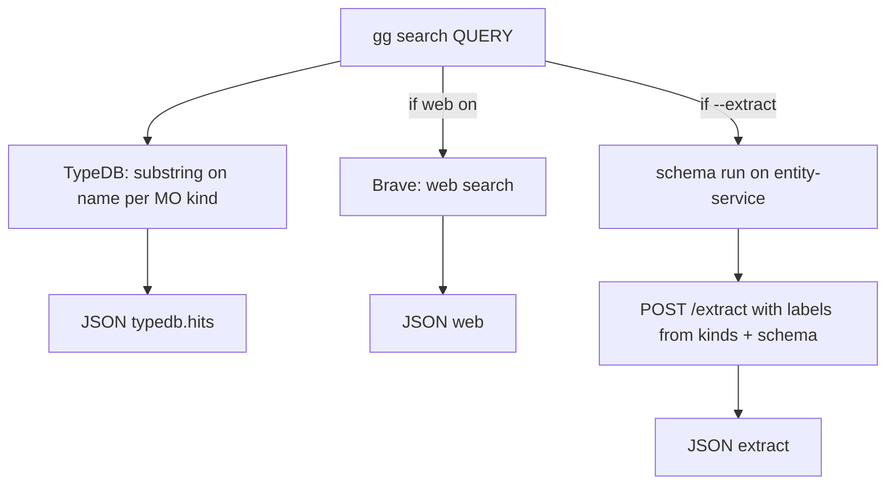
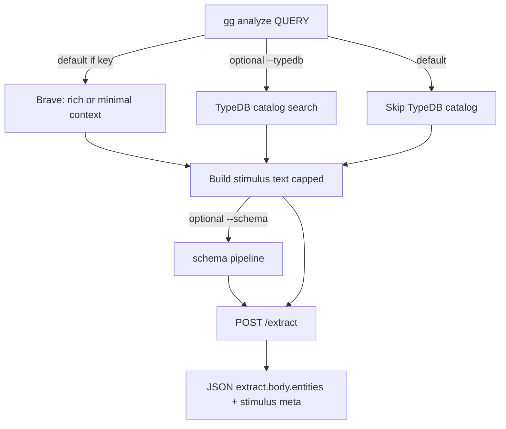
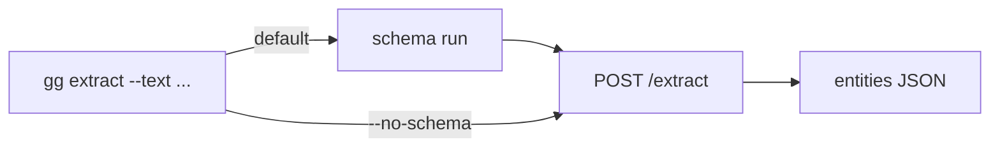
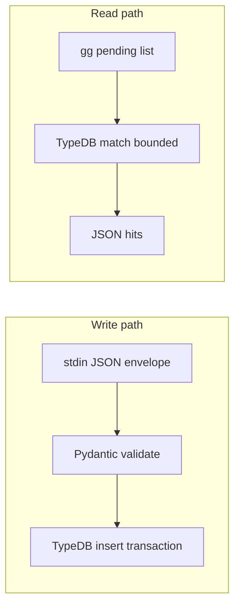

# GrooveGraph v2 — workflows (`gg` and integrations)

This document is the **visual map** of how the CLI, TypeDB, entity-service, and Brave fit together. For HTTP field-level detail, see [`USER_AND_AGENT_GUIDE.md`](USER_AND_AGENT_GUIDE.md). For env names, see repo-root [`.env.example`](../.env.example).

---

## 1. Who talks to whom (system context)

GrooveGraph **`gg`** runs on your machine, loads **repo-root `.env`**, and coordinates three external systems:

| System | GrooveGraph uses it for |
|--------|-------------------------|
| **TypeDB** | Catalog search (`gg search`), draft ingest (`gg ingest-draft`), pending listing (`gg pending list`), `gg doctor` type list. |
| **entity-service** | `POST /extract`, optional `POST /schema-pipeline/*`, `GET /health` (or `/ready` / `/docs`) for doctor. |
| **Brave** | Optional web search to enrich text before extract or search. |

**Important:** TypeDB credentials in **your** `.env` drive the **CLI** driver. The **schema pipeline** on entity-service uses **that service’s** process env — they are not automatically the same file.

---

## 2. Startup (every `gg` command)

- **Repo root** is discovered by walking up from `cwd` until `typedb/` and `.env.example` exist (`repo_root_from`).
- **`--pretty`**: global form `gg --pretty <cmd>` or per-command `--pretty` after args.

---

## 3. Readiness — `gg doctor`

- **`--probe`**: if Brave key missing, Brave section fails (stricter check).
- Use this before relying on `search`, `schema`, or `analyze`.

---

## 4. Schema pipeline — `gg schema …`

Runs on **entity-service** only (TypeDB must be configured **on that server** for success).

| Command | Role |
|---------|------|
| **`gg schema raw`** | `POST /schema-pipeline/raw` with `{"assumptions":{"entityTypes":[]}}` → raw define + assumptions JSON (entity-service requires this body shape). |
| **`gg schema validate`** | Reads **stdin** (raw JSON), `POST /schema-pipeline/validate`. |
| **`gg schema formatted`** | Reads **stdin** (raw JSON), `POST /schema-pipeline/formatted`. |
| **`gg schema run`** | Same orchestration as internal callers: raw → validate → formatted. |

**Downstream:** formatted output becomes the `schema` field on **`POST /extract`** when you use `gg search --extract`, `gg extract` (default), or `gg analyze --schema`.

---

## 5. Catalog search — `gg search`

- **DB-first:** always queries TypeDB catalog (allowlisted kinds; default all MO tokens).
- **`--web` / `--no-web`:** default web **on** when `BRAVE_API_KEY` is set.
- **`--extract`:** forwards **label list** from `--types` (or all) plus schema pipeline output.

---

## 6. Discovery NER — `gg analyze`

For **greenfield** work: no catalog types required up front; **`labels: []`** so entity-service is not narrowed by your MO list.

| Flag | Effect |
|------|--------|
| **`--context rich`** (default) | Several Brave titles + stripped snippets → longer text for NER. |
| **`--context minimal`** | Query + first web title only. |
| **`--use-model`** | `options.use_model: true` on `/extract`. |
| **`--schema`** | Attach schema from pipeline (needs TypeDB on entity-service). |
| **`--emit-stimulus`** | Include full stimulus text in JSON (can be large). |

Tally **`entity.label`** in **`extract.body.entities`** to plan TypeQL catalog types.

---

## 7. Direct extract — `gg extract`

- Optional **`--labels`** (comma-separated) filters entity-service output.
- **`--use-model`** forwards to `options.use_model`.

---

## 8. Persist drafts — `gg ingest-draft` and `gg pending list`

- **`ingest-draft`:** `ingestion-batch` + catalog entities in one write (see [`cli/README.md`](../cli/README.md) for stdin example).
- **`pending list`:** reads entities with `approval-status` filter (default `pending`).

---

## 9. Environment variables (summary)

| Variable | Used by |
|----------|---------|
| `TYPEDB_*` | CLI driver (`gg search`, `ingest-draft`, `pending`, `doctor`). |
| `NER_SERVICE_URL` | All entity-service HTTP calls (default `http://127.0.0.1:8000`). |
| `BRAVE_API_KEY` / `BraveSearchApiKey` | Brave search when enabled. |
| `OPENAI_API_KEY` | Reserved for future LLM tooling (logged as present only). |
| `GG_LOG_LEVEL` | CLI and pytest log verbosity. |

Full list: [`.env.example`](../.env.example).

---

## 10. Logs and tests

| Artifact | Purpose |
|----------|---------|
| `logs/gg.log` | Rotating CLI log (repo root). |
| `logs/pytest.log` | Pytest session log. |

**Pytest markers:** `core`, `entity_service`, `e2e`, `brave_only` — see [`cli/README.md`](../cli/README.md). Upstream schema gaps: tags in [`ENTITY_SERVICE_PUNCH_LIST.md`](ENTITY_SERVICE_PUNCH_LIST.md).

---

## 11. Related docs

| Doc | Content |
|-----|---------|
| [`v2-implementer-defaults.md`](v2-implementer-defaults.md) | Decisions and slice checklist. |
| [`v2-product-qa-log.md`](v2-product-qa-log.md) | Full Q&A. |
| [`ENTITY_SERVICE_PUNCH_LIST.md`](ENTITY_SERVICE_PUNCH_LIST.md) | Entity-service vs GrooveGraph responsibilities. |
| [`typedb/README.md`](../typedb/README.md) | Manual schema apply. |
| [`ontology/mo-coverage-matrix.md`](../ontology/mo-coverage-matrix.md) | MO coverage. |
