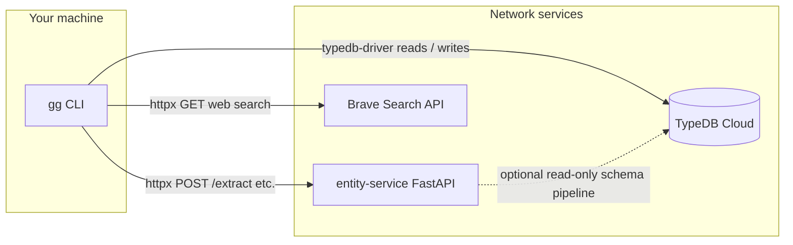
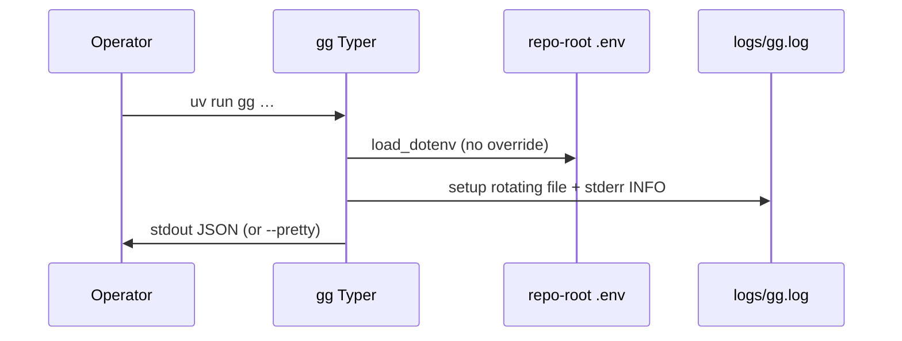
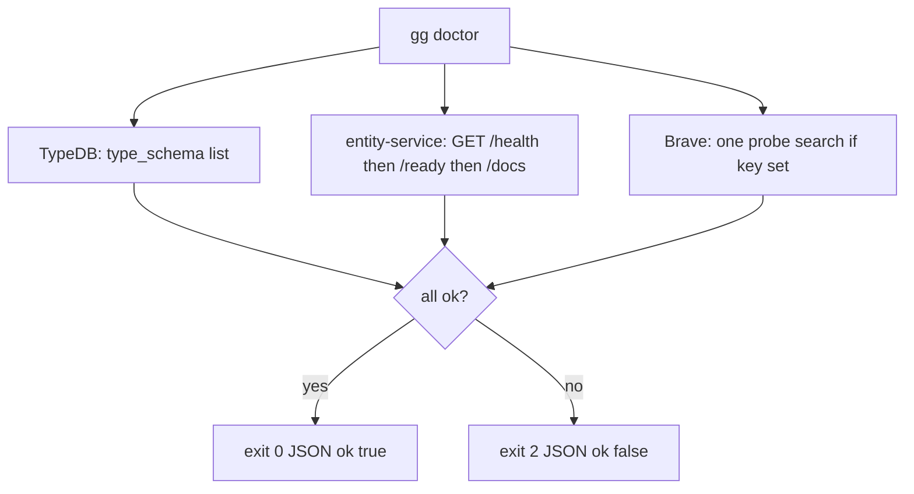
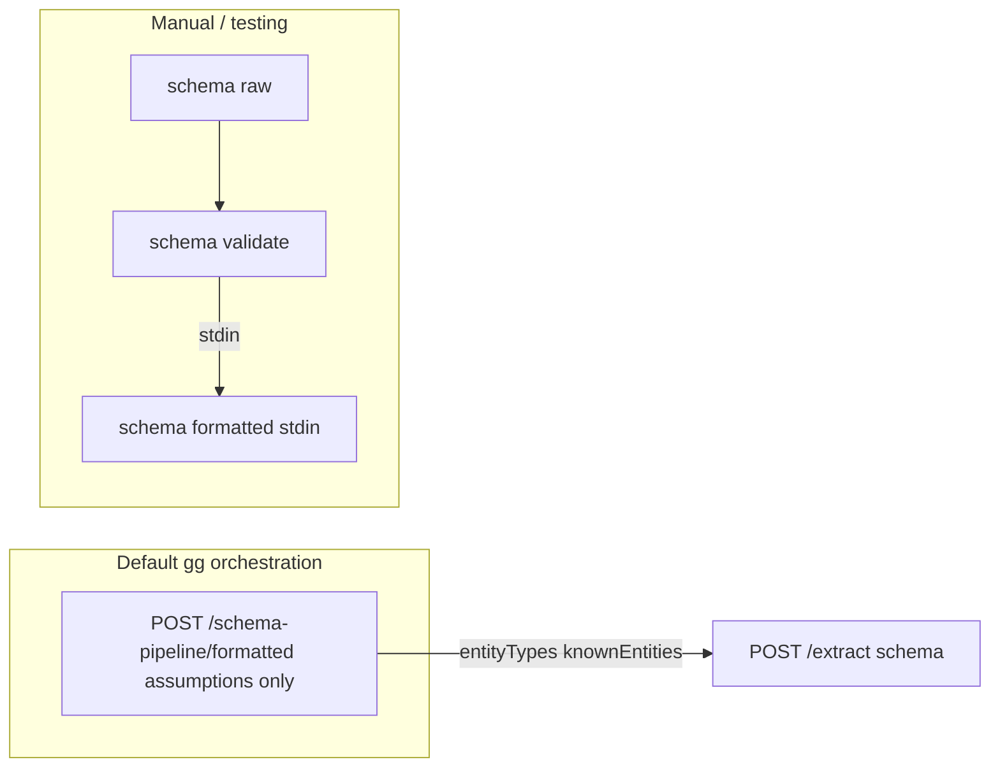
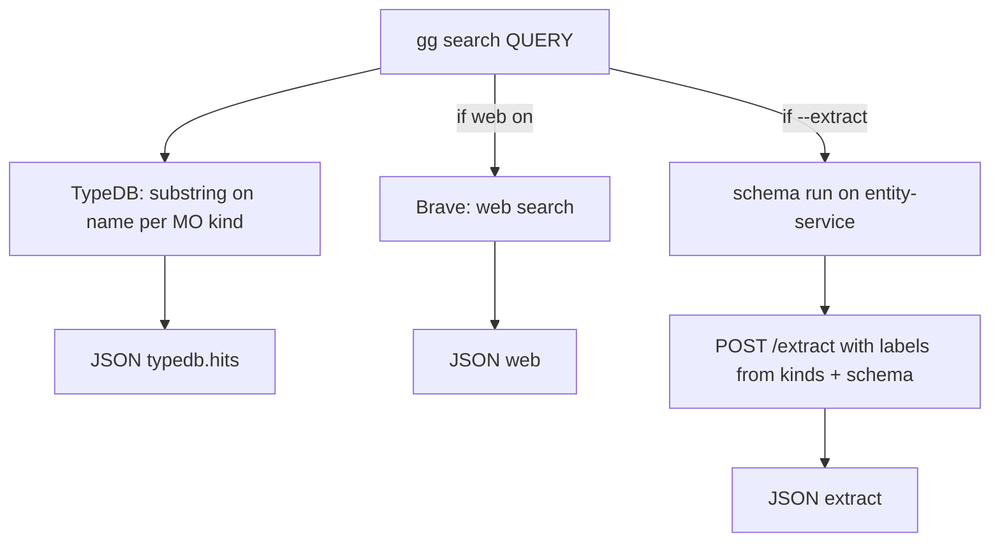
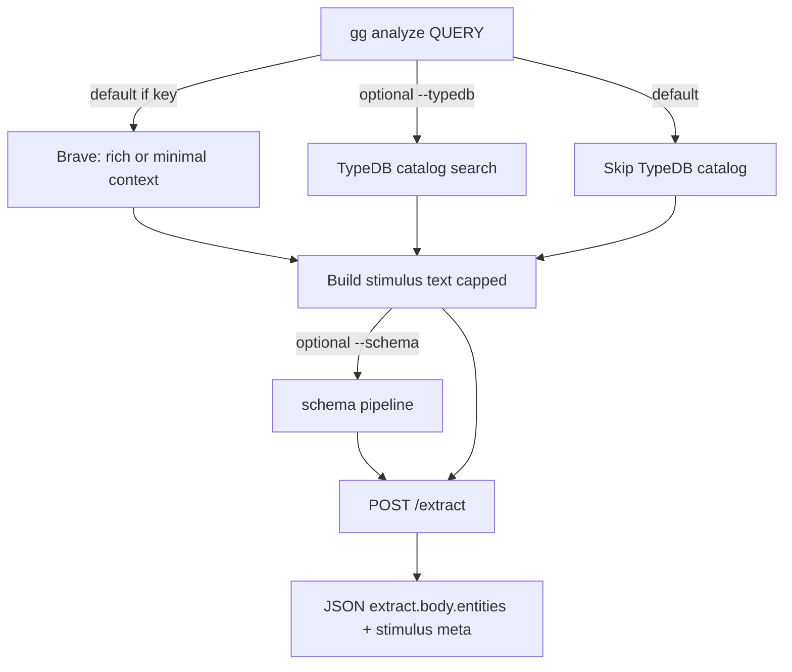
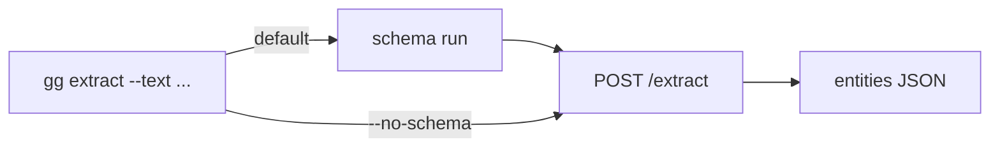
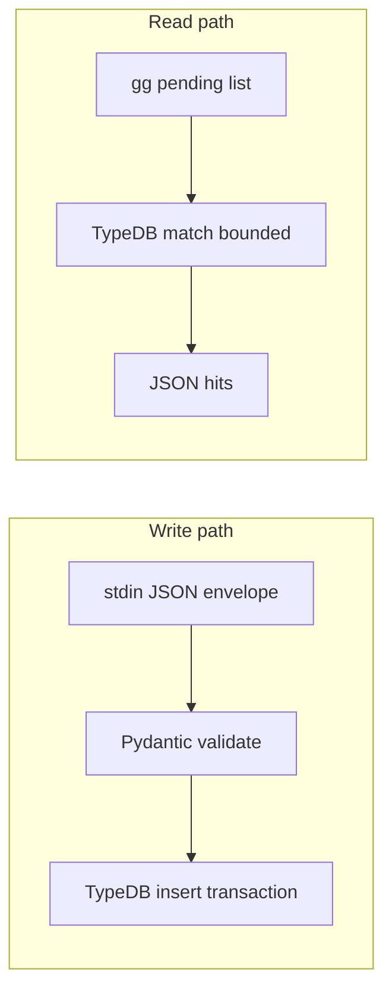

# GrooveGraph v2 — workflows (`gg` and integrations)

This document is the **visual map** of how the CLI, TypeDB, entity-service, and Brave fit together. For HTTP field-level detail, see [`USER_AND_AGENT_GUIDE.md`](USER_AND_AGENT_GUIDE.md). For env names, see repo-root [`.env.example`](../.env.example).

---

## 1. Who talks to whom (system context)

GrooveGraph **`gg`** runs on your machine, loads **repo-root `.env`**, and coordinates three external systems:

| System | GrooveGraph uses it for |
|--------|-------------------------|
| **TypeDB** | Catalog search (`gg search`), draft ingest (`gg ingest-draft`), pending listing (`gg pending list`), `gg doctor` type list. |
| **entity-service** | `POST /extract`, optional `POST /schema-pipeline/*`, `GET /health` (or `/ready` / `/docs`) for doctor. |
| **Brave** | Optional web search to enrich text before extract or search. |

**Important:** TypeDB credentials in **your** `.env` drive the **CLI** driver. The **schema pipeline** on entity-service uses **that service’s** process env — they are not automatically the same file.

---

## 2. Startup (every `gg` command)

- **Repo root** is discovered by walking up from `cwd` until `typedb/` and `.env.example` exist (`repo_root_from`).
- **`--pretty`**: global form `gg --pretty <cmd>` or per-command `--pretty` after args.

---

## 3. Readiness — `gg doctor`

- **`--probe`**: if Brave key missing, Brave section fails (stricter check).
- Use this before relying on `search`, `schema`, or `analyze`.

### 3.1 Explore mode — `gg explore` (canonical slice)

Until we add more operator pipelines, treat **explore** as the default “find what you can” path: **sanity is mandatory**, then **TypeDB + Brave + entity-service** in one JSON result.

1. **`gg doctor`** — **required** preflight for explore: same checks as **`gg doctor --probe`** (`TypeDB` + entity-service `GET /health` → `/ready` → `/docs` + **mandatory Brave** probe). Missing `BRAVE_API_KEY` or a failed probe → **`gg explore`** exits **2** with `error: doctor_failed`.
2. **Catalog types in TypeDB (instances later)** — by default **`--auto-catalog-schema`** runs **before** Brave/ES: if `mo-music-artist` is not yet defined in the target database, **`gg`** applies **`typedb/groovegraph-schema.tql`** in a **TypeDB SCHEMA** transaction (attributes + MO entity types + `ingestion-batch`). Use **`--no-auto-catalog-schema`** to skip (fail-soft catalog search only). **Warning:** only use on empty or dedicated databases if you already use a different schema shape.
3. **Canonical APIs + Brave + same stimulus to ES** — catalog substring search runs on TypeDB; **Wikipedia + MusicBrainz + Discogs** (see [`WEB_ENRICHMENT.md`](WEB_ENRICHMENT.md)) plus optional **Brave** snippets are merged into the **`text`** for **`POST /extract`** (`stimulus_compose.py`, `brave_extract_context.py`).
4. **Entity-service** — **`POST /schema-pipeline/formatted`** (needs **`TYPEDB_*` on the ES process**) → **`POST /extract`** with that **`text`**, returned **`schema`**, **`labels`** from `--types` **plus the reserved bucket** **`gg-generic`** (so untyped spans can be returned; see `docs/AGENT_ENTITY_SERVICE_ISSUES.md` §1.1), and **`options`** (`use_aliases: true`; **`--use-model`** sets `use_model: true` for GLiNER when enabled upstream).
5. **Optional instance persist** — **`gg explore QUERY --ingest`** maps **`entities[]`** whose **`label`** is an allowlisted MO kind into **`gg ingest-draft`** rows (`approval_status: pending`) in one WRITE transaction. Unknown labels are listed under **`ingest.skipped`** (no guessed types). **`--batch-id`** overrides the default `explore-YYYYMMDD-…` id.

**ES HTTP checklist (contract in `USER_AND_AGENT_GUIDE.md`):**

| Stage | Method + path | Notes |
|--------|----------------|-------|
| Preflight | `GET /health` (+ `/ready`, `/docs` via doctor) | Proves process up; does **not** prove `/extract` or `/formatted`. |
| Schema slice | `POST /schema-pipeline/formatted` | Needs **`TYPEDB_*` on the ES process** (separate from `gg`’s `.env`). |
| NER | `POST /extract` | **`text`** (required), **`schema`** (optional, from formatted), **`labels`**, **`options`**. |

If the **topic** Brave call fails after doctor passed (rate limit, network) **and** canonical sources (Wikipedia / MusicBrainz / Discogs) also yield no text, **`gg explore`** returns **`ok: false`** with **`extract.error: insufficient_context`** and does **not** call entity-service for that run. If canonical enrichment produced text, extract still runs (Brave snippets are optional when canonical succeeded). See [`WEB_ENRICHMENT.md`](WEB_ENRICHMENT.md).

For scripted acceptance after doctor, still run the **`POST /formatted` → `POST /extract`** probes in [`AGENT_ENTITY_SERVICE_ISSUES.md`](AGENT_ENTITY_SERVICE_ISSUES.md) §4 when debugging upstream.

---

## 4. Schema pipeline — `gg schema …`

Runs on **entity-service** only (TypeDB must be configured **on that server** for success).

| Command | Role |
|---------|------|
| **`gg schema run`** | **`POST /schema-pipeline/formatted`** only — assumes types **already exist** in TypeDB; body `{"assumptions":{"entityTypes":[]},"skipOntologyPrecheck":false}` (same as `extract` / `analyze --schema`). |
| **`gg schema raw`** | `POST /schema-pipeline/raw` — **initial testing / define text inspection** only. |
| **`gg schema validate`** | Reads **stdin** (includes `typeSchemaDefine` from raw), `POST /schema-pipeline/validate`. |
| **`gg schema formatted`** | Reads **stdin**; `POST /schema-pipeline/formatted` (with `typeSchemaDefine` when present). |

**Downstream:** `formatted` JSON becomes the `schema` field on **`POST /extract`** when you use `gg search --extract`, `gg extract` (default), or `gg analyze --schema`.

---

## 5. Catalog search — `gg search`

Prefer **`gg explore QUERY`** for the combined doctor + DB + web + extract path (§3.1). **`gg search`** remains the building block with explicit flags.

- **DB-first:** always queries TypeDB catalog (allowlisted kinds; default all MO tokens).
- **`--web` / `--no-web`:** default web **on** when `BRAVE_API_KEY` is set.
- **`--extract`:** **`POST /schema-pipeline/formatted`** then **`POST /extract`**; stimulus **`text`** uses **rich Brave excerpts** when web succeeded (same builder as `gg analyze --context rich`).

---

## 6. Discovery NER — `gg analyze`

For **greenfield** work: no catalog types required up front; **`labels: []`** so entity-service is not narrowed by your MO list.

| Flag | Effect |
|------|--------|
| **`--context rich`** (default) | Several Brave titles + stripped snippets → longer text for NER. |
| **`--context minimal`** | Query + first web title only. |
| **`--use-model`** | `options.use_model: true` on `/extract`. |
| **`--schema`** | Attach schema from pipeline (needs TypeDB on entity-service). |
| **`--emit-stimulus`** | Include full stimulus text in JSON (can be large). |

Tally **`entity.label`** in **`extract.body.entities`** to plan TypeQL catalog types.

---

## 7. Direct extract — `gg extract`

- Optional **`--labels`** (comma-separated) filters entity-service output.
- **`--use-model`** forwards to `options.use_model`.

---

## 8. Persist drafts — `gg ingest-draft` and `gg pending list`

- **`ingest-draft`:** `ingestion-batch` + catalog entities in one write (see [`cli/README.md`](../cli/README.md) for stdin example).
- **`pending list`:** reads entities with `approval-status` filter (default `pending`).

---

## 9. Environment variables (summary)

| Variable | Used by |
|----------|---------|
| `TYPEDB_*` | CLI driver (`gg search`, `ingest-draft`, `pending`, `doctor`). |
| `NER_SERVICE_URL` | All entity-service HTTP calls (default `http://127.0.0.1:8000`). |
| `BRAVE_API_KEY` / `BraveSearchApiKey` | Brave search when enabled. |
| `OPENAI_API_KEY` | Reserved for future LLM tooling (logged as present only). |
| `GG_LOG_LEVEL` | CLI and pytest log verbosity. |

Full list: [`.env.example`](../.env.example).

---

## 10. Logs and tests

| Artifact | Purpose |
|----------|---------|
| `logs/gg.log` | Rotating CLI log (repo root). |
| `logs/pytest.log` | Pytest session log. |

**Pytest markers:** `core`, `entity_service`, `e2e`, `brave_only` — see [`cli/README.md`](../cli/README.md). Upstream schema gaps: tags in [`AGENT_ENTITY_SERVICE_ISSUES.md`](AGENT_ENTITY_SERVICE_ISSUES.md) §1.2 (historical checklist: [`archive/ENTITY_SERVICE_PUNCH_LIST.md`](archive/ENTITY_SERVICE_PUNCH_LIST.md)).

---

## 11. Related docs

| Doc | Content |
|-----|---------|
| [`GROOVEGRAPH_V2_PRODUCT_AND_BUILD_SYNTHESIS.md`](GROOVEGRAPH_V2_PRODUCT_AND_BUILD_SYNTHESIS.md) | Product + build synthesis (Q1–Q33, defaults, slice); verbatim Q&A in [`archive/v2-product-qa-log.md`](archive/v2-product-qa-log.md). |
| [`archive/ENTITY_SERVICE_PUNCH_LIST.md`](archive/ENTITY_SERVICE_PUNCH_LIST.md) | **Archived** entity-service integration checklist. |
| [`AGENT_ENTITY_SERVICE_ISSUES.md`](AGENT_ENTITY_SERVICE_ISSUES.md) | Why ES may not return entities / empty `knownEntities`; two TypeDB configs; acceptance checks. |
| [`typedb/README.md`](../typedb/README.md) | Manual schema apply. |
| [`ontology/mo-coverage-matrix.md`](../ontology/mo-coverage-matrix.md) | MO coverage. |
