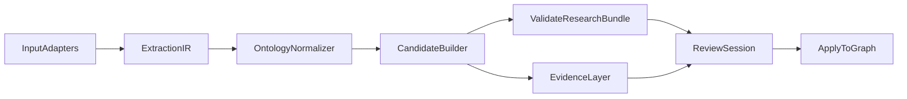

# Generic Ontology-Guided Enrichment Plan

## Goals

- Make enrichment input-agnostic so both triplets and span/mention extraction produce a common intermediate representation.
- Keep the stack TypeScript-only (no Python dependency).
- Support both `wink-nlp` and `compromise` concurrently for controlled A/B testing and ensemble synthesis.
- Preserve your ontology constraints from [d:\Studio13\Lab\Code\GrooveGraph\docs\DOMAIN_MODEL.md](d:\Studio13\Lab\Code\GrooveGraph\docs\DOMAIN_MODEL.md).
- Add model routing so GPT-5 usage is cost-aware without sacrificing quality on hard cases.

## Current Baseline (What we will leverage)

- Shared review/apply contracts and session model in [d:\Studio13\Lab\Code\GrooveGraph\src\enrichment\types.ts](d:\Studio13\Lab\Code\GrooveGraph\src\enrichment\types.ts).
- Strong bundle validation gate in [d:\Studio13\Lab\Code\GrooveGraph\src\enrichment\llm\validate-bundle.ts](d:\Studio13\Lab\Code\GrooveGraph\src\enrichment\llm\validate-bundle.ts).
- Session import/review/apply engine in [d:\Studio13\Lab\Code\GrooveGraph\src\enrichment\review.ts](d:\Studio13\Lab\Code\GrooveGraph\src\enrichment\review.ts).
- Triplet orchestration route in [d:\Studio13\Lab\Code\GrooveGraph\app\api\enrich\explore-triplet\route.ts](d:\Studio13\Lab\Code\GrooveGraph\app\api\enrich\explore-triplet\route.ts).

## Progress and changes

- **Phase 1 (partial):** Extraction IR and workflow type are in place. No UI or API behavior changed.
  - **Done:** `EnrichmentWorkflowType` and `workflowType` on session `importMetadata`; `inferWorkflowType(importedFrom, explicitWorkflowType)` in `review.ts` (maps `triplet-exploration` → `triplet`, `llm-only` → `llm_only`, `span-mention` → `span_mention`, else `hybrid`).
  - **Done:** Source-agnostic IR types in `types.ts`: `ExtractionMention`, `ExtractionRelation`, `ExtractionAssertion`, `ExtractionIR`. These sit upstream of `ResearchBundle`.
- **Phase 2 (started):** Adapter contract and IR↔Bundle conversion in place; both adapters implemented; triplet route uses IR path.
  - **Done:** Adapter interface `ExtractionAdapter` and input types (`TripletExtractionInput`, `SpanMentionExtractionInput`) in `src/enrichment/extraction/types.ts`. Optional `ExtractionResultWithMetadata` for pipeline provenance.
  - **Done:** `irToResearchBundle(ir, ...)` and `bundleToIR(bundle)` in `src/enrichment/extraction/normalize-ir.ts`.
  - **Done:** `tripletExtractionAdapter` — runs triplet pipeline, returns `{ ir, metadata, generatedAt, summary }`; used by explore-triplet route.
  - **Done:** Triplet flow wired through IR: `POST /api/enrich/explore-triplet` uses `tripletExtractionAdapter.extract()` → `irToResearchBundle()` → `importResearchBundle()` (metadata preserved).
  - **Done:** `spanMentionExtractionAdapter` — uses rule-based mention extraction: `extractMentionsFromText()` in `src/enrichment/extraction/rule-based-mentions.ts` (capitalized/phrase spans, ontology default label, confidence low). Relations still empty.
  - **Done:** Extraction orchestrator: `runExtraction(input, ontology)` in `src/enrichment/extraction/orchestrator.ts` dispatches by input type to the correct adapter and returns `{ result, runMetadata }` with `ExtractionRunMetadata` (engineName, engineMode, latencyMs, mentionCount, relationCount). Used by extract route for span_mention.
  - **Done:** `POST /api/enrich/extract` supports `workflowType: "span_mention"` with body `{ text, sourceId? }`; creates session with one stub target, runs orchestrator, `irToResearchBundle` → `importResearchBundle` with `importedFrom: "span-mention"`, returns session + researchPacket + runMetadata.
  - **Done (orchestrator):** `ExtractionEngineMode` and `runExtraction(..., { mode })` in orchestrator; `ENRICHMENT_EXTRACTION_MODE` env; only single-engine path implemented; ab_test/dual_run/ensemble merge not yet.
  - **Done:** Compromise NER adapter: `extractMentionsWithCompromise()` in `src/enrichment/extraction/compromise-mentions.ts`, `spanMentionCompromiseAdapter` in `src/enrichment/adapters/span-mention-compromise-adapter.ts`. `ENRICHMENT_ENGINE_PRIMARY=compromise` selects it for single mode.
  - **Done:** dual_run/ensemble: orchestrator runs all span_mention engines when mode is dual_run or ensemble, merges IR via `mergeExtractionIR()` (dedupe mentions by span, remap ids, union relations). ab_test picks one engine by hash or random per `ENRICHMENT_AB_BUCKET_STRATEGY`.
  - **Next:** Relation extraction from compromise or LLM; wink-nlp as additional engine.
- **Phase 3 (started):** Ontology normalization before bundle creation.
  - **Done:** `normalizeExtractionIR(ir, ontology)`: coerce mention labels; filter relations by allowed types and valid mention ids; set `canonicalKey` on each mention (slug of text) for alias/canonical matching. Wired into `irToResearchBundle()`; `CandidateNode.canonicalKey` uses `mention.canonicalKey` when present.
  - **Done:** `ExtractionMention.canonicalKey` optional field; normalizer sets it so downstream (e.g. graph match in import) can use it.
  - **Done:** Store-backed alias/canonical match is in the import path: `review.ts` `sanitizeNodeCandidate` → `matchNodeCandidate(store, candidate)` matches by external ids and by exact display name within label; sets `matchedNodeId` and `matchStatus: "matched_existing"` when a graph node is found. IR-derived `canonicalKey` flows into candidates and is used for identity dedup in apply.
  - **Done:** Low-confidence / disambiguation flag: `ExtractionMention.needsDisambiguation` set by normalizer when label was coerced or confidence is low; `irToResearchBundle` sets `CandidateNode.notes` to "Label inferred or low confidence; may need disambiguation." for those so review UI can surface them. LLM disambiguation can later target mentions/candidates with this flag.
  - **Next:** Optional LLM disambiguation step for mentions with `needsDisambiguation` (e.g. resolve type or entity id); ProposedConcept or dedicated review queue if desired.
- **Changelog:** 2026-03-12 — Phase 1–3, 5 (async span_mention/llm_only/triplet), 6–8 (complexity, orchestrator mode, retry, idempotency). Phase 8: idempotency key → jobId in job store; extract route returns existing job for same key. Tests: job-store.test.ts, merge-ir.test.ts.

## Target Architecture

## Phase 1: Introduce a Generic Extraction IR (no UI breakage)

- Add a new IR contract (e.g., `ExtractionMention`, `ExtractionRelation`, `ExtractionAssertion`) that is source-agnostic.
- Keep existing `ResearchBundle` output as the apply/review contract; IR is an upstream normalization layer.
- Add `workflowType` (`triplet`, `span_mention`, `llm_only`, `hybrid`) to session metadata to avoid stringly `importedFrom` branching.
- Files to extend first:
  - [d:\Studio13\Lab\Code\GrooveGraph\src\enrichment\types.ts](d:\Studio13\Lab\Code\GrooveGraph\src\enrichment\types.ts)
  - [d:\Studio13\Lab\Code\GrooveGraph\src\enrichment\review.ts](d:\Studio13\Lab\Code\GrooveGraph\src\enrichment\review.ts)

## Phase 2: Build TypeScript Input Adapters

- Define adapter interface: `extract(input, ontology) => ExtractionIR`.
- Implement two adapters:
  - `TripletAdapter` (existing triplet flow reimplemented as IR producer).
  - `SpanMentionAdapter` (text/doc input to mentions/relations).
- TypeScript-first libraries (no Python):
  - Tokenization/rules: `wink-nlp` and `compromise` (both first-class).
  - Fuzzy/entity matching: `fuse.js` + existing canonical key logic.
  - Optional local embeddings/rerank in TS: `transformers.js` (only where needed).
- Keep NER extraction hybrid-ready: deterministic alias/rule pass first, LLM disambiguation second.
- Add an extraction orchestrator with explicit runtime modes:
  - `ab_test`: route each request to one engine via hash/random assignment.
  - `dual_run`: run both engines on the same input and persist separate outputs.
  - `ensemble`: run both, then merge outputs into one synthesized IR.
- Add per-engine run metadata for evaluation:
  - `engineName`, `engineVersion`, `engineMode`, `latencyMs`, `mentionCount`, `relationCount`, `conflictCount`.
- Add an ensemble merge policy:
  1. exact span + type agreement => confidence boost
  2. span agreement + type disagreement => ontology constraints, then LLM tie-break
  3. unique-to-one-engine mentions => keep as low-confidence assertions for review
- Primary files:
  - [d:\Studio13\Lab\Code\GrooveGraph\src\enrichment\triplet.ts](d:\Studio13\Lab\Code\GrooveGraph\src\enrichment\triplet.ts)
  - new `src/enrichment/adapters/*` modules
  - new `src/enrichment/extraction/*` modules
  - [d:\Studio13\Lab\Code\GrooveGraph\app\api\enrich\explore-triplet\route.ts](d:\Studio13\Lab\Code\GrooveGraph\app\api\enrich\explore-triplet\route.ts)

## Phase 3: Ontology Normalization Layer

- Add an explicit normalizer stage before `ResearchBundle` creation:
  1. Exact alias/canonical-key match
  2. Contextual constraint checks from ontology (`allowedEntityLabels`, allowed relationships)
  3. LLM disambiguation only for unresolved/ambiguous mentions
  4. Low-confidence fallback to `ProposedConcept` / review queue item
- Reuse and extend validation gate rather than replacing it.
- Primary files:
  - [d:\Studio13\Lab\Code\GrooveGraph\src\enrichment\llm\validate-bundle.ts](d:\Studio13\Lab\Code\GrooveGraph\src\enrichment\llm\validate-bundle.ts)
  - [d:\Studio13\Lab\Code\GrooveGraph\src\enrichment\review.ts](d:\Studio13\Lab\Code\GrooveGraph\src\enrichment\review.ts)

## Phase 4: Evidence Layer (ontology-guided NER/EL discipline)

- Add first-class provenance/evidence entities (even if stored as graph metadata initially):
  - `SourceDocument`, `SourceChunk`, `Mention`, `RelationAssertion`.
- Keep materialized canonical graph edges separate from assertions.
- Materialize only when confidence + ontology constraints pass thresholds.
- This keeps triplet and mention workflows consistent and auditable.

## Phase 5: API Surface for Generic Enrichment

- **Done:** Generic route `POST /api/enrich/extract` accepts `workflowType` + payload; triplet route retained and delegated from extract.
- **Done:** Async job mode for `span_mention`: when `body.async === true`, the route returns **202** with `{ jobId, status: "accepted", statusUrl: "/api/enrich/jobs/{jobId}" }`; extraction runs in the background; clients poll **GET /api/enrich/jobs/{id}** for status. Completed jobs return `{ status: "completed", session, researchPacket, runMetadata }`; failed jobs return `{ status: "failed", error }`. In-memory job store (`src/enrichment/extraction/job-store.ts`); use Redis or DB for multi-instance.
- **Done:** Async for `llm_only` and triplet: when `body.async === true`, extract route returns 202 with jobId; clients poll GET /api/enrich/jobs/{id}. llm_only runs in background via `runLlmOnlyExtractAsync`; triplet runs via `runTripletExtractAsync` (invokes explore-triplet handler).
  - **Next:** Idempotency keys (Phase 8).

## Phase 6: GPT-5 Model Routing (accuracy vs expense)

- **Done:** Complexity derivation and model routing hook: `src/enrichment/extraction/complexity.ts` — `deriveExtractionComplexity(ir, options?)`, `getModelForExtractionComplexity(complexity)`, `ENRICHMENT_COMPLEXITY_FRONTIER_THRESHOLD`. **Wired:** Triplet exploration pipeline uses complexity-based model when `TRIPLET_LLM_MODEL` is not set: builds minimal IR from targets, sets `hasAnyScope` from `hasAnySubject`/`hasAnyObject`, then selects model via `getModelForExtractionComplexity(deriveExtractionComplexity(ir, { hasAnyScope }))`. When `TRIPLET_LLM_MODEL` is set, it overrides (unchanged behavior).
- **Done:** Task-level model routing: `ExtractionTaskType` and `getModelForTask(taskType, complexity?)` in `src/enrichment/extraction/complexity.ts`. Env keys `ENRICHMENT_MODEL_PRECHECK`, `ENRICHMENT_MODEL_NORMALIZE`, `ENRICHMENT_MODEL_RELATION_EXTRACT`, `ENRICHMENT_MODEL_SYNTHESIS`, `ENRICHMENT_MODEL_TRIPLET_EXPAND`. LLM-only pipeline uses `getModelForTask("synthesis", complexity)`; triplet pipeline uses `getModelForTask("triplet_expand", complexity)`.
- Recommended routing policy:
  - `gpt-5-mini` (or smallest available GPT-5 tier):
    - low-risk normalization checks, alias expansion suggestions, schema prechecks.
  - `gpt-5` mid tier:
    - default for relation extraction and moderate triplet queries.
  - `gpt-5.4` frontier:
    - high-ambiguity disambiguation, broad `any:any` triplet expansion, final synthesis over many sources.
- Add env-based routing knobs:
  - `ENRICHMENT_MODEL_SMALL`, `ENRICHMENT_MODEL_MEDIUM`, `ENRICHMENT_MODEL_FRONTIER`
  - `ENRICHMENT_COMPLEXITY_FRONTIER_THRESHOLD`
- Add engine-orchestration knobs:
  - `ENRICHMENT_EXTRACTION_MODE=ab_test|dual_run|ensemble`
  - `ENRICHMENT_AB_BUCKET_STRATEGY=hash|random`
  - `ENRICHMENT_ENGINE_PRIMARY=wink|compromise`
  - `ENRICHMENT_ENSEMBLE_TIEBREAKER=gpt|rules`

## Phase 7: A/B Evaluation and Ensemble Governance

- Add evaluator for wink vs compromise outputs:
  - agreement rate on mention boundaries and labels
  - precision proxy from curator approvals/rejections
  - recall proxy from accepted net-new entities/relations
  - cost per accepted assertion (model + runtime)
- Store side-by-side extraction artifacts for reproducible comparisons.
- Define promotion policy:
  - keep `dual_run` in staging until stability threshold met
  - promote `ensemble` to production default when conflict handling and cost are acceptable
  - retain `ab_test` for periodic drift checks after go-live

## Phase 8: Reliability and Performance Hardening

- Keep extended timeout controls for frontier tasks.
- **Done:** Retry policy in `src/enrichment/llm/fetch-with-retry.ts`: `fetchWithRetry()` for 5xx/timeout/abort with backoff; `ENRICHMENT_LLM_MAX_RETRIES`, `ENRICHMENT_LLM_RETRY_DELAY_MS`. LLM-only and triplet pipelines wrap fetch in retry.
- **Done:** Idempotency keys for async extract: when `body.idempotencyKey` or header `Idempotency-Key` is set, the job store maps key → jobId. Retries with the same key receive the same job (202 if pending, 200 with result if completed/failed). `setJobIdForIdempotencyKey` / `getJobIdForIdempotencyKey` in `src/enrichment/extraction/job-store.ts`; extract route checks before creating a new job.
- Add chunked/segmented synthesis for heavy triplet runs (per-album batches) then merge.

## Phase 9: Testing & Rollout

- **Done:** Golden-style regression test for extraction pipeline: `src/enrichment/extraction/extraction-pipeline.test.ts` — (1) IR from rule-based mentions → `irToResearchBundle` → bundle shape and notes for low-confidence; (2) `fromRef`/`toRef` integrity for relations; (3) triplet-style fixture round-trip: fixture `ResearchBundle` → `bundleToIR` → `irToResearchBundle` → same sessionId, target/candidate/edge counts, labels and relation type preserved.
- Triplet route e2e (with LLM) can reuse existing explore-triplet route; fixture test covers IR↔bundle path without network.
- Regression tests around:
  - ~~ontology label/type normalization~~ (covered in ontology-normalize-ir.test.ts)
  - ~~candidate reference integrity (fromRef/toRef)~~ (covered in extraction-pipeline.test.ts)
  - ~~confidence threshold materialization~~ (extraction-pipeline.test: confidence high/medium/low flow to candidates; low gets notes)
  - **Done:** Job store unit tests: `job-store.test.ts` (createJobId, setJob/getJob, idempotency key map). Merge IR tests: `merge-ir.test.ts` (dedupe by span, relation id remap).
  - async job completion and retry behavior (e2e or route-level)
- Rollout plan:
  1. feature flag generic IR path
  2. triplet route migrated to generic core
  3. span/mention route enabled
  4. async mode default for frontier tasks

## Success Criteria

- Same review/apply UX handles triplet and span/mention outputs.
- No Python required; all extraction/normalization modules are TypeScript.
- `wink-nlp` and `compromise` can run in `ab_test`, `dual_run`, and `ensemble` modes with measurable metrics.
- 5xx/timeouts reduced via async + retry + batching on heavy frontier tasks.
- Cost drops because most requests use small/medium models, with frontier invoked only by measured complexity.

